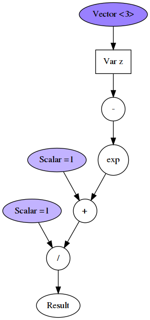

CGraph
===


> C Computation Graph Library

### Build Status:
[](https://travis-ci.org/praisethemoon/cgraph)

- OpenCL API is still WIP, still learning it .. Turn off CG_USE_OPENCL `option(CG_USE_OPENCL "OpenCL acceleration" OFF)` in the root `CMakeLists.txt`  file.

- Development being done on Mac OS, with few tests on Ubuntu 18 LTS.

### About

CGraph, short for C Computation Graph is a C library for building Tensor graphs and automatic differenciation.

### Optimizations
Uses BLAS for complex operations.

The current version focuses on clear code rather than highly performant one.
Once everything is well tested, hard optimizations such as switch statements and others will be improved.
Also not all operations are written in blas, some uses classic for-loop, as I am still learning BLAS,
optimizations will come once the library becomes stable.

### Dependencies:

- LAPACK: `sudo apt-get install libblas-dev liblapack-dev`
- cmake `sudo apt-get install cmake`
- probably `build-essentials` as well.
- lua5.1 at least. LuaJIT is not support due to its 1~2Gb memory limitation.
- cairo for kplot

### OpenCL dependencies
- OpenCL driver
- cf4ocl [https://github.com/fakenmc/cf4ocl](https://github.com/fakenmc/cf4ocl)
- CLBlast [https://github.com/CNugteren/CLBlast/](https://github.com/CNugteren/CLBlast/)


###### Notes

- Currently tested only on ubuntu 16.04 LTS and Ubuntu 18.04.1 LTS (Plasma Desktop, I know it has nothing to do, just wanted to say it)
- Matrices are by default Row major
- Vectors are treated as column matrices

### Limitations:
- Double numbers only.

### C API Status:
- Memory management has been greatly improved, but needs more checking, especilly with the gradient calculation
- C API is almost stable.
- Could create more sanity check APIs
- Could use more unittests.

### Lua API status:
- Working but need memory improvements
- No unittest
- Easy to setup and use, but not yet reliable.

### Example (Lua API):

```lua
local CGraph = require 'CGraph'
local array = CGraph.array


local function sigmoid(z)
	local Z = CGraph.variable("z")
	local sigmoid = CGraph.double(1) / (CGraph.double(1) + CGraph.exp(-Z))
	local graph = CGraph.graph("sigmoid", sigmoid)
	graph:setVar("z", z)
	local res = graph:eval()
	graph:plot()
	return res
end

print(sigmoid(CGraph.dot( CGraph.vector(3, array {0,0,0}), CGraph.vector(3, array {0,0,0}) )))

return sigmoid
```

`graph:plot()` will plot a graph as a `dot` which can be transformed into a png with graphviz's `dot` command: `dot -Tpng sigmoid.dot -o sigmoid.png`.



### Building and Running Neural Network Example

- You would need lua socket installed `sudo apt-get install lua-socket lua-sec`
- Or manually download iris dataset and place it into `datasets/Iris.csv`.

Compiling C and Lua API

```
cd source
mkdir build
cd build
cmake ..
make
cd ../../lua_api
mv source/build/lua_api/libluacgraph.so ./libcgraph.so
```

Then, from `examples_lua` directory
```
lua iris.lua
```

### Debugging

If you had an error while running a Lua script, you can debug it as follows:

```
gdb lua
(gdb) source luagdb.txt
(gdb) run iris.lua
```

And from there you have access to the C API from gdb.

### Future work
- Graph variables (Done)
- Lua API for graph construction (Done)
- Derivative calculations (Done)
- Usage of BLAS in all operations (In progress)
- GPU BLAS implementation (clBLAS probably & raw OpenCL as well)
- Multithreaded implementation
- Graph plotting and visualization (Done, outdated)
- Switch to LuaJIT instead of Lua API (Must do ASAP)
- Travis CI (done)
- Valgrind to check memory (Done)
- Optimal data fetching and allocation (Lazy evaluation)

### Dependencies included within the source code:
- Lua programming language [https://github.com/lua/lua](https://github.com/lua/lua)
- tinycthreads [https://github.com/tinycthread/tinycthread](https://github.com/tinycthread/tinycthread)
- dmt [https://github.com/rxi/dmt](https://github.com/rxi/dmt)
- map  [https://github.com/rxi/map](https://github.com/rxi/map)
- vec [https://github.com/rxi/vec](https://github.com/rxi/vec)
- smallprofiler [https://github.com/realbogart/smallprofiler](https://github.com/realbogart/smallprofiler)
- luaarray [http://www.nongnu.org/techne/lua/luaarray/](http://www.nongnu.org/techne/lua/luaarray/)
- minunit [https://github.com/siu/minunit](https://github.com/siu/minunit)
- Remotery [https://github.com/Celtoys/Remotery](https://github.com/Celtoys/Remotery)
- Underscore [https://github.com/jtarchie/underscore-lua](https://github.com/jtarchie/underscore-lua)
- KPlot [https://github.com/kristapsdz/kplot](https://github.com/kristapsdz/kplot)
- STB Image and Image Write [https://github.com/nothings/stb](https://github.com/nothings/stb)
- nuklear ui [https://github.com/vurtun/nuklear](https://github.com/vurtun/nuklear)
- Mersenne Twister random number generator: [http://www.math.sci.hiroshima-u.ac.jp/~m-mat/MT/emt.html](http://www.math.sci.hiroshima-u.ac.jp/~m-mat/MT/emt.html)
- progressbar [https://github.com/doches/progressbar](https://github.com/doches/progressbar)
- minicsv parser (https://github.com/jedisct1/minicsv)[https://github.com/jedisct1/minicsv]

### Contributions

If you would like to contribute, feel free to fork this stuff.
A wonderful start would be to include a unit test file to check all the functionalities of either API.

Here is a list of the things I want to add:

- Better plotting tools
- Image filters
- `io` subject, csv, json, xml, tar, etc
- Dataset loaders i.e mnist
- Propose anything you want.

##### What I really insist on:
- Pure C API (might even remove CLBlast if I can get to write my own kernels)
- No global variables & Thread Safety
- Memory profiling
- Seperation of intel libraries and public API (CAPI project)
