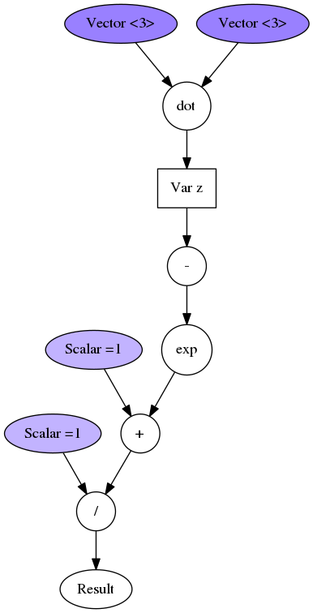

CGraph
===


> C Computation Graph Library

### About

CGraph, short for C Computation Graph is a C library for building Tensor graphs.
It will support a Lua API in the future.

> You see the logo? Illuminaty confirmed

### Optimizations
Uses BLAS for complex operations.

The current version focuses on clear code rather than highly performant.
Once everything is well tested, hard optimizations such as switch statements and others will be improved.
Also not all operations are written in blas, some uses classic for-loop, as I am still learning BLAS,
optimizations will come once the library becomes stable.

### Dependencies:

- LAPACK: `sudo apt-get install libblas-dev liblapack-dev`
- cmake `sudo apt-get install cmake`
- probably `build-essentials` as well.

###### Notes

- Currently tested only on ubuntu 16.04
- Matrices are by default Row major (can be changed manually).

### Limitations:
- Double numbers only.

### Supported Operations:

|operator|type|lhs|rhs|uhs|implemented|
|:---:|:---:|:---:|:---:|:---:|:---:|
|`*`|binary|`double`|`double`||:heavy_check_mark:|
|`*`|binary|`double`|`vector`||:heavy_check_mark:|
|`*`|binary|`double`|`matrix`||:heavy_check_mark:|
|`*`|binary|`vector`|`double`||:heavy_check_mark:|
|`*`|binary|`matrix`|`double`||:heavy_check_mark:|
|`*` (cross)|binary|`vector`|`vector`||:heavy_check_mark:|
|`*`|binary|`matrix`|`vector`||:heavy_check_mark:|
|`*`|binary|`matrix`|`matrix`||:heavy_check_mark:|
|`+`|binary|`double`|`double`||:heavy_check_mark:|
|`+`|binary|`double`|`vector`||:heavy_check_mark:|
|`+`|binary|`double`|`matrix`||:heavy_check_mark:|
|`+`|binary|`vector`|`vector`||:heavy_check_mark:|
|`+`|binary|`vector`|`double`||:heavy_check_mark:|
|`+`|binary|`matrix`|`double`||:heavy_check_mark:|
|`+`|binary|`matrix`|`matrix`||:heavy_check_mark:|
|`+`|binary|`matrix`|`vector`||:heavy_check_mark:|
|`-`|binary|`double`|`double`||:heavy_check_mark:|
|`-`|binary|`double`|`vector`||:heavy_check_mark:|
|`-`|binary|`double`|`matrix`||:heavy_check_mark:|
|`-`|binary|`vector`|`double`||:heavy_check_mark:|
|`-`|binary|`vector`|`vector`||:heavy_check_mark:|
|`-`|binary|`vector`|`matrix`||:heavy_check_mark:|
|`-`|binary|`matrix`|`double`||:heavy_check_mark:|
|`-`|binary|`matrix`|`vector`||:heavy_check_mark:|
|`-`|binary|`matrix`|`matrix`||:heavy_check_mark:|
|`/`|binary|`double`|`double`||:heavy_check_mark:|
|`/`|binary|`vector`|`double`||:heavy_check_mark:|
|`/`|binary|`matrix`|`double`||:heavy_check_mark:|
|`^`|binary|`double`|`double`||:heavy_check_mark:|
|`^`|binary|`vector`|`double`||:heavy_check_mark:|
|`^`|binary|`matrix`|`double`||:heavy_check_mark:|
|`.`|binary|`vector`|`vector`||:heavy_check_mark:|
|`^T*`|binary|`vector`|`double`||:heavy_multiplication_x:|
|`^T*`|binary|`vector`|`vector`||:heavy_multiplication_x:|
|`^T*`|binary|`matrix`|`double`||:heavy_multiplication_x:|
|`^T*`|binary|`matrix`|`vector`||:heavy_multiplication_x:|
|`^T*`|binary|`matrix`|`matrix`||:heavy_multiplication_x:|
|`-`|unary|||`double`|:heavy_check_mark:|
|`-`|unary|||`vector`|:heavy_check_mark:|
|`-`|unary|||`matrix`|:heavy_check_mark:|
|`inv`|unary|||`double`|:heavy_multiplication_x:|
|`inv`|unary|||`vector`|:heavy_multiplication_x:|
|`inv`|unary|||`matrix`|:heavy_multiplication_x:|
|`T`|unary|||`matrix`|:heavy_check_mark:|
|`exp`|unary|||`double`|:heavy_check_mark:|
|`exp`|unary|||`vector`|:heavy_check_mark:|
|`exp`|unary|||`matrix`|:heavy_check_mark:|
|`log`|unary|||`double`|:heavy_check_mark:|
|`log`|unary|||`vector`|:heavy_check_mark:|
|`log`|unary|||`matrix`|:heavy_check_mark:|

### Example (Lua API):

```lua
local CGraph = require 'CGraph'
local array = CGraph.array


local function sigmoid(z)
	local Z = CGraph.variable("z")
	local sigmoid = CGraph.double(1) / (CGraph.double(1) + CGraph.exp(-Z))
	local graph = CGraph.graph("sigmoid", sigmoid)
	graph:setVar("z", z)
	graph:plot()
	local res = graph:eval()
	return res
end

print(sigmoid(CGraph.double(0)))


return sigmoid
```

returns:

`Scalar [value: 0.5]`

and created a file named `sigmoid.dot` containing the DOT Graph instance:

```dot
digraph sigmoid{
	1 [label="B /"];
	2 [label="Scalar =1"];
	3 [label="B +"];
	4 [label="Scalar =1"];
	5 [label="U exp"];
	6 [label="U -"];
	7 [label="Variable z"];
	1 -> Result ;
	2 -> 1;
	3 -> 1;
	4 -> 3;
	5 -> 3;
	6 -> 5;
	7 -> 6;
}
```

You can plot it with Graphviz's `dot` cmd line: `dot -Tpng sigmoid.dot -o sigmoid.png` to get




### Future work
- Graph variables (done)
- Lua API for graph construction (done)
- Derivative calculations
- Usage of BLAS in all operations
- GPU BLAS Implentations (cuBLAS probably & CUDA as well
- Multithreaded implentation
- Analyze graph to optimize calculations i.e `A^T.xB` is 3 three operations expression that can be reduced to one operation in BLAS.
- Graph plotting and visualization (done)
- Switch to LuaJIT instead of Lua API
- Travis CI (done)
- Valgrind to check memory

### Dependencies included within the source code:
- Lua programming language [https://github.com/lua/lua](https://github.com/lua/lua)
- tinycthreads [https://github.com/tinycthread/tinycthread](https://github.com/tinycthread/tinycthread)
- dmt [https://github.com/rxi/dmt](https://github.com/rxi/dmt)
- map  [https://github.com/rxi/map](https://github.com/rxi/map)
- vec [https://github.com/rxi/dmt](https://github.com/rxi/dmt)
- smallprofiler [https://github.com/realbogart/smallprofiler](https://github.com/realbogart/smallprofiler)
- luaarray [http://www.nongnu.org/techne/lua/luaarray/](http://www.nongnu.org/techne/lua/luaarray/)

### Help Requested
If you would like to contribute, feel free to fork this stuff.
A wonderful start would be to include a unit test file to check all the functionalities.
